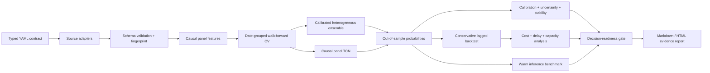

# Signalattice

**Calibrated market forecasts, tested as decisions rather than celebrated as scores.**

Signalattice is a config-driven research system for asking whether a probabilistic
forecast is reliable, stable, economically usable, and fast enough for its declared
decision cadence. It connects chronology-safe panel modeling to model-risk diagnostics,
cost and delay frontiers, liquidity proxies, inference benchmarks, and an explicit
`READY` / `NOT_READY` gate.

The central artifact is evidence, not a headline backtest. A run records what data was
used, how each forecast was produced, whether probabilities were calibrated on unseen
dates, how performance changes under implementation friction, and why a result did or did
not clear its configured thresholds.

> Signalattice is research software, not financial advice or a live trading system.
> Synthetic and historical simulations do not establish deployable alpha or future
> profitability.

## Research questions

Signalattice is built to answer five questions in order:

1. **Discrimination:** does the model rank future outcomes better than a naive baseline?
2. **Calibration:** does a forecast of `0.60` occur at roughly a 60% empirical rate?
3. **Stability:** is evidence consistent across forward-chaining test periods and date-block
   bootstrap samples?
4. **Decision value:** does any gross edge survive costs, added delay, turnover, and
   conservative portfolio constraints?
5. **Operational fit:** are inference latency and dollar-volume participation compatible
   with the intended use?

Passing one question never substitutes for another. The readiness gate exposes each
criterion independently and fails closed on missing or non-finite evidence.

## What makes this project different

[AlphaForge](https://github.com/srgangaram-swe/AlphaForge) explores systematic alpha,
regimes, portfolio construction, and execution-oriented research. Signalattice focuses on
a different layer of the stack: calibrated probability estimation, causal panel sequence
models, forecast diagnostics, model risk, and ForecastOps decision gates. It deliberately
does not duplicate an order-book simulator, execution engine, or strategy-control API.

## System at a glance



Key capabilities include:

- typed, fail-fast configuration with deterministic seeds and config-aware data caches;
- a typed feature registry, immutable content-addressed DuckDB/Parquet store, quality and
  drift gates, verified predicate reads, and resumable bounded backfills;
- explicit market-data source identity—synthetic data is never silently substituted unless
  the run opts into that behavior;
- ticker-local trailing features and whole-date train/test boundaries for panel data;
- walk-forward or expanding evaluation with an embargo constrained to be at least the
  forecast horizon;
- a heterogeneous classifier ensemble with a trailing, date-grouped inner holdout split
  again into earlier calibrator-fit dates and later log-loss weighting dates;
- optional causal dilated temporal convolution over per-ticker histories, with chronological
  validation, early stopping, gradient clipping, deterministic CPU execution, persistence,
  and gradient-times-input diagnostics;
- proper probability scores, reliability tables, Brier decomposition, expected calibration
  error, ROC and precision-recall analysis, selective prediction, prediction-decile returns,
  fold stability, and date-block bootstrap intervals;
- long-only and dollar-neutral research portfolios with probability or quantile selection,
  no-trade bands, position and gross-exposure limits, causal volatility targeting, costs,
  and explicit execution lag;
- cost, delay, break-even cost, dollar-volume participation, capacity-proxy, and warm
  inference latency diagnostics; and
- unit and integration tests for chronology, candidate/calibrator/weighting separation,
  portfolio invariants, missing-data failure modes, temporal tensor construction,
  persistence, and report inputs.

See [Architecture](docs/architecture.md), [Methodology](docs/methodology.md), and the
[Validation protocol](docs/validation_protocol.md) for the contracts behind these claims.

## Evidence boundary

The committed example is a deterministic **synthetic engineering experiment**. Its data
generator contains moderate, declared autocorrelation effects so the pipeline can be tested
against a known causal signal; setting both autocorrelation coefficients to zero creates a
null directional process. Recovering that planted structure demonstrates implementation
behavior, not discovery of a market anomaly.

Signalattice can also evaluate public daily data, but that does not remove vendor,
survivorship, revision, adjustment, or multiple-testing risk. The project has no broker
connection, order management, intraday market-impact model, point-in-time constituent
database, or claim of live P&L.

Every report should therefore be read with its source label and readiness verdict. A
profitable synthetic backtest that fails calibration or stability remains `NOT_READY`; a
historical run that passes configured gates is a candidate for deeper research, not an
authorization to trade.

## Diagnostic report

The generated report combines predictive, economic, and operational evidence. Depending
on the configured model and available inputs, figures include:

- reliability and score-by-outcome diagrams;
- ROC and precision-recall curves;
- selective coverage versus accuracy;
- prediction-decile forward returns;
- walk-forward metric and feature-importance stability;
- calibrated ensemble weights;
- gross-to-net implementation drag;
- cost and execution-delay frontiers;
- AUM participation and capacity proxies;
- latency/throughput profiles; and
- equity, drawdown, exposure, turnover, and monthly-return diagnostics.

The reproducible example output lives under [reports/example](reports/example). Generated
plots are supporting diagnostics; no single plot is treated as proof of tradability.

## Quickstart

Signalattice uses a standard `src/` package layout and exposes both `signalattice` and the
legacy `quant-platform` console aliases.

```bash
python3 -m venv .venv
source .venv/bin/activate
python -m pip install --upgrade pip
python -m pip install -e ".[dev]"
```

Run the deterministic offline experiment:

```bash
signalattice run-full-pipeline --config configs/synthetic.yaml --force
```

Run the public-data configuration after installing source adapters:

```bash
python -m pip install -e ".[dev,data]"
signalattice run-full-pipeline --config configs/example.yaml --force
```

Public-data runs fail if the requested source or universe is unavailable. For an explicitly
synthetic run, set `data.source: synthetic`; opt-in `allow_synthetic_fallback` exists for
clearly labeled engineering workflows, but it is disabled by default.

Install optional model backends only when a config requests them:

```bash
python -m pip install -e ".[dev,boost]"  # XGBoost / LightGBM
python -m pip install -e ".[dev,torch]"  # causal TCN
```

Requested optional backends fail closed when their dependency is absent. Signalattice does
not silently replace an experiment's declared model with another estimator.

## Workflow

```bash
signalattice ingest-data --config configs/example.yaml
signalattice build-features --config configs/example.yaml
signalattice train-model --config configs/example.yaml
signalattice run-backtest --config configs/example.yaml
signalattice generate-report --config configs/example.yaml
signalattice list-experiments --config configs/example.yaml
```

A full run produces configured equivalents of:

```text
data/raw/{TICKER}.parquet                 source snapshots
data/processed/price_panel.parquet       validated canonical panel
data/processed/panel_metadata.json       source, hash, config fingerprint, seed
data/processed/features.parquet          feature/target matrix
models/{project}_model.joblib            model + preprocessing + feature contract
experiments/experiments.sqlite           run metadata and metrics
reports/{run}/                           report and diagnostic figures
```

Generated market data, models, and experiment stores are ignored. Only the documented,
reproducible example evidence is committed.

## Development

```bash
make test
make lint
make typecheck
make demo
```

Docker:

```bash
docker compose build
docker compose run --rm platform run-full-pipeline --config configs/synthetic.yaml --force
```

The CI workflow runs static checks, unit/integration tests across supported Python
versions, and a deterministic end-to-end smoke test. Deep-learning tests are isolated
behind the optional PyTorch dependency.

## Repository map

```text
configs/                    reproducible experiment contracts
docs/                       architecture, model/data cards, validation, ADRs
reports/example/            committed reproducible evidence
src/quant_platform/data/    ingestion, contracts, validation, synthetic DGP
src/quant_platform/features feature and target construction
src/quant_platform/models/  splits, ensemble, TCN, training, diagnostics
src/quant_platform/backtest conservative vectorized portfolio simulation
src/quant_platform/evaluation implementation and readiness diagnostics
src/quant_platform/risk/    performance, tail-risk, exposure, stress analysis
src/quant_platform/reporting plots and evidence reports
src/quant_platform/tracking experiment lineage
tests/                      unit and integration contracts
```

## Documentation

- [Architecture](docs/architecture.md)
- [Nasdaq Data Link ingestion boundary](docs/nasdaq_data_link.md)
- [Signal Foundry dataset contract](docs/signal_foundry_contract.md)
- [Feature registry, immutable store, and resumable backfills](docs/feature_store.md)
- [Methodology](docs/methodology.md)
- [Model card](docs/model_card.md)
- [Data card](docs/data_card.md)
- [Validation protocol](docs/validation_protocol.md)
- [Backtesting contract](docs/backtesting.md)
- [Risk metrics](docs/risk_metrics.md)
- [ADR 0001: probabilistic ForecastOps](docs/adr/0001-probabilistic-forecastops.md)

## Known limitations

- Daily OHLCV bars cannot validate intraday fills, spread, queue position, borrow, or
  market impact.
- The public example universe is small and fixed, not survivorship-bias-free or historically
  point-in-time.
- Adjusted public data can be revised and lacks an institutional corporate-action audit
  trail.
- The capacity calculation is a trailing dollar-volume participation proxy, not an
  execution simulator.
- The latency evidence covers warm local inference and a separate local synthetic
  feature-store workload, not feed handling, provider transit, distributed serving, risk
  checks, or order acknowledgement.
- The current research harness does not establish external replication, paper trading, or
  live post-trade attribution.

The [Validation protocol](docs/validation_protocol.md) describes what additional evidence
would be required before any production or capital-allocation discussion.
