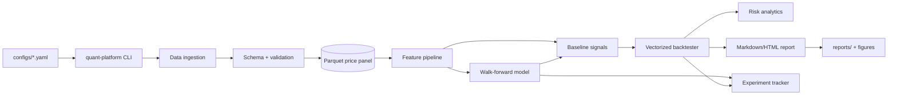

# quant-research-data-platform

Production-style research platform for quant finance data engineering, feature research,
machine learning, backtesting, risk analytics, experiment tracking, and reporting.

This repository is built as a portfolio-quality internal research platform: modular
Python package, typed configs, reproducible CLI workflows, meaningful tests, CI, Docker,
documentation, and generated sample outputs.

> Disclaimer: this project is for educational and portfolio purposes only. It is not
> financial advice and is not intended for live trading. Backtests are simulations and do
> not guarantee future performance.

## Why this project exists

Breaking into quant research engineering requires showing more than notebooks. This
project demonstrates the software and research hygiene expected in a hedge fund, prop
trading, asset management, or systematic trading environment:

- reproducible market data ingestion with schema validation and offline fallback
- leakage-aware feature engineering for time-series and cross-sectional factors
- walk-forward machine learning with time-series-safe splits
- vectorized long-only and long/short backtesting with costs and slippage
- risk analytics, scenario analysis, and portfolio reporting
- local experiment tracking with dataset hashes, parameters, metrics, artifacts, and git
  commit metadata where available
- tests, CI, Docker, pre-commit, docs, and resume positioning material

## Architecture



See [docs/architecture.md](docs/architecture.md) for the module-level design.

## Repository layout

```text
.
├── configs/                 # Reproducible run configs
├── data/                    # Raw/processed/external data dirs with docs and .gitkeep files
├── docs/                    # Architecture and methodology notes
├── notebooks/               # Lightweight research walkthrough
├── reports/                 # Generated reports; example output is committed under reports/example
├── scripts/                 # Reproducible helper scripts
├── src/quant_platform/      # Python package
├── tests/                   # Unit and integration tests
├── Dockerfile
├── docker-compose.yml
├── Makefile
├── pyproject.toml
└── .github/workflows/ci.yml
```

## Setup

```bash
python3 -m venv .venv
source .venv/bin/activate
python -m pip install --upgrade pip
python -m pip install -e ".[dev]"
```

Optional market data adapters:

```bash
python -m pip install -e ".[dev,data]"
```

The platform runs without network dependencies by falling back to deterministic
synthetic data.

## Quickstart

Run the full example pipeline:

```bash
python -m quant_platform.cli run-full-pipeline --config configs/example.yaml --force
```

Or use the installed console script:

```bash
quant-platform run-full-pipeline --config configs/example.yaml --force
```

The example config uses `SPY`, `QQQ`, `AAPL`, `MSFT`, `NVDA`, `JPM`, and `TLT`.
With optional data dependencies it attempts public market data first; otherwise it uses
the synthetic fallback and still exercises the full pipeline.

Expected outputs:

- processed panel: `data/processed/price_panel.parquet`
- feature matrix: `data/processed/features.parquet`
- report: `reports/example/example_report.md`
- figures: `reports/example/figures/*.png`
- experiment tracking DB: `experiments/experiments.sqlite`
- model bundle: `models/example_model.joblib`

For a guaranteed offline demo:

```bash
make demo
```

## CLI commands

```bash
quant-platform ingest-data --config configs/example.yaml
quant-platform build-features --config configs/example.yaml
quant-platform train-model --config configs/example.yaml
quant-platform run-backtest --config configs/example.yaml
quant-platform generate-report --config configs/example.yaml
quant-platform run-full-pipeline --config configs/example.yaml --force
quant-platform list-experiments --config configs/example.yaml
```

## Methodology

The platform uses a long-format daily price panel keyed by `(date, ticker)`.
Features are computed within ticker groups using only trailing information. Targets are
forward returns and next-period direction labels. Model signals are generated from
walk-forward out-of-sample predictions and then shifted in the backtester so a signal at
close `t` earns returns at `t+1`.

Key feature families:

- simple and log returns
- rolling volatility, realized volatility, and rolling Sharpe
- moving-average and exponential moving-average ratios
- RSI, MACD, Bollinger bands
- momentum, 12-1 momentum, short-horizon reversal, z-scores
- volume trend features
- rolling beta to benchmark
- drawdown and rolling max drawdown
- cross-sectional ranks and z-scores

Modeling approaches:

- rules-based factor baselines (`momentum`, `ma_crossover`)
- sklearn classifiers/regressors such as logistic regression, random forest, and gradient boosting
- optional XGBoost, LightGBM, MLflow, and PyTorch LSTM backends

Backtesting includes:

- long-only and long/short modes
- equal-weight, rank, and volatility-target sizing
- transaction costs and slippage in basis points
- benchmark comparison, equity curve, drawdowns, turnover, monthly returns, and trade summary

Risk analytics include:

- annualized volatility, Sharpe, Sortino, Calmar, CAGR
- max drawdown, VaR, CVaR, beta, correlation matrix
- exposure analysis and stress scenarios

## Sample outputs

The committed example report and figures live under [reports/example](reports/example).
Regenerate them with:

```bash
bash scripts/run_example_pipeline.sh
```

## Development

```bash
make test
make lint
make typecheck
make pipeline CONFIG=configs/example.yaml
```

Docker:

```bash
docker compose build
docker compose run --rm platform run-full-pipeline --config configs/synthetic.yaml
```

CI runs linting, tests across supported Python versions, and a synthetic end-to-end smoke
test in GitHub Actions.

## Limitations

- Daily close-to-close data only; no intraday, order book, borrow, or corporate action audit trail.
- Free public data can have adjustment and survivorship-bias issues.
- Transaction costs and slippage are simplified flat bps assumptions.
- The example universe is fixed and small; it is not a production tradable universe.
- The platform is designed for research demonstration, not live order execution.

## Future work

- survivorship-bias-free universes and point-in-time membership
- intraday data and event-driven execution simulator
- factor risk model and portfolio optimization layer
- purged nested CV and hyperparameter search
- distributed runs and cloud artifact storage

## Resume bullets

- Built a production-style quant research data platform in Python covering ingestion,
  validation, feature engineering, ML modeling, vectorized backtesting, risk analytics,
  experiment tracking, reporting, tests, CI, Docker, and docs.
- Implemented leakage-aware walk-forward ML for cross-sectional return-direction signals
  with out-of-sample metrics, feature importance, and transaction-cost-aware backtests.
- Engineered reusable time-series factor pipelines for volatility, momentum, mean reversion,
  beta, drawdown, volume, and cross-sectional ranking features backed by typed YAML configs.

LinkedIn summary: Built an end-to-end quant finance research platform that turns market
data into validated Parquet datasets, factor features, walk-forward ML signals, cost-aware
backtests, risk reports, experiment records, and reproducible CI-tested artifacts.
