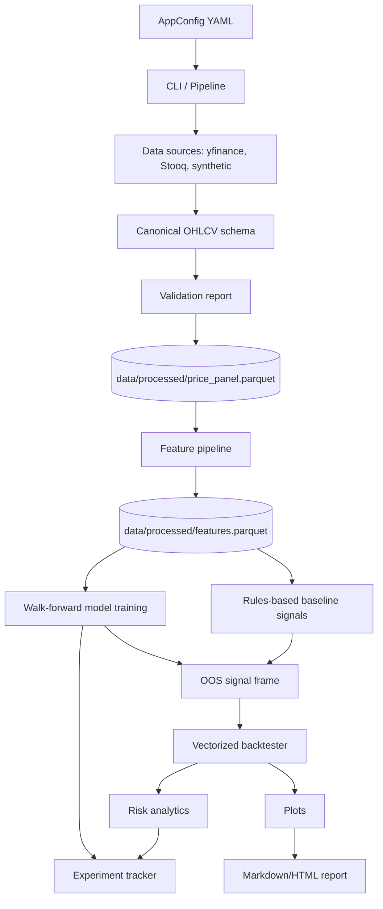

# Architecture

The platform is organized around a config-driven research workflow. Each stage can run
independently through the CLI, while `Pipeline.run_full()` executes the complete DAG in a
single tracked experiment.



## Core packages

- `quant_platform.config`: Pydantic models for typed YAML configuration and environment overrides.
- `quant_platform.data`: source adapters, schema coercion, validation, ingestion, and Parquet loading.
- `quant_platform.features`: technical indicators, cross-sectional transforms, feature matrix, and targets.
- `quant_platform.models`: estimator factory, time-series splits, walk-forward training, metrics, and optional LSTM.
- `quant_platform.backtest`: vectorized cross-sectional portfolio engine with costs and slippage.
- `quant_platform.risk`: performance, drawdown, VaR, CVaR, beta, exposures, and stress tests.
- `quant_platform.tracking`: SQLite, JSON, MLflow, and no-op experiment tracking.
- `quant_platform.reporting`: plots and self-contained Markdown/HTML run reports.
- `quant_platform.cli`: Typer commands for stage-by-stage or full-pipeline execution.

## Data contracts

The canonical price panel is long format:

```text
date | ticker | open | high | low | close | adj_close | volume | return | log_return
```

The feature matrix preserves the same keys and adds:

- `f_*` columns for features
- `target_forward_return`
- `target_direction`

This makes downstream selection explicit and reduces leakage risk.

## Artifact flow

- raw per-ticker parquet: `data/raw/*.parquet`
- processed panel: `data/processed/price_panel.parquet`
- feature matrix: `data/processed/features.parquet`
- model bundle: `models/{project_name}_model.joblib`
- report and plots: configured under `reports/`
- experiment records: `experiments/experiments.sqlite` or JSON files

Generated data and models are gitignored. The example report under `reports/example/` is
committed as a portfolio artifact.
