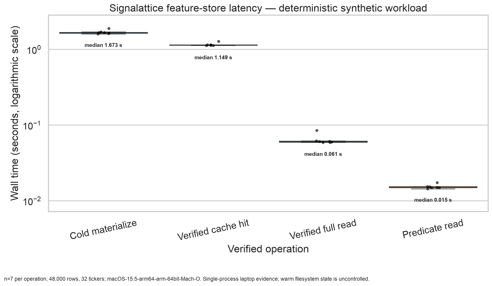

# Feature registry, immutable store, and resumable backfills

Signalattice materializes research features through a local-first evidence boundary:
typed feature definitions identify semantics, immutable Parquet objects hold values, a
DuckDB catalog maps semantic requests to objects transactionally, and canonical manifests
bind every source, transform, quality decision, and file hash.

This is an offline research feature store. It is not an online serving system, distributed
catalog, vendor-data redistribution mechanism, or claim of trading readiness.

## Contract and identity

Every `FeatureSpec` records:

- stable name and semantic version;
- family, exact input columns, parameters, sampling frequency, and output dtype;
- lookback and warm-up bars;
- normalization and missing-value policy;
- leakage-risk classification and implementation SHA-256; and
- for a learned transform, its method, fitted-state SHA-256, fit interval, and sample count.

`train_fitted` features require fitted state, and the fit interval must end strictly before
the application interval. Rolling and same-date cross-sectional features cannot carry a
learned fitted state. Parameters are finite, non-executable scalar values; credential-shaped
parameter names are rejected.

A materialization request binds the registry to:

- the full source dataset and request hashes;
- provider/source revision and schema;
- requested and returned universes;
- source retrieval and coverage timestamps;
- redistribution and point-in-time completeness flags;
- benchmark, price field, target columns, and forward-label horizon;
- application interval and partitioning policy;
- full code commit and allowlisted runtime/dependency identity; and
- versioned quality and drift thresholds.

Canonical JSON with sorted keys and no non-finite values is SHA-256 hashed. The request
identity changes when any semantic input changes; changing a label horizon cannot reuse a
matrix created under an older target definition. The object identity additionally binds the
logical DataFrame hash and every Parquet partition's path, hash, size, row count, and coverage.

## Storage and publication

```text
data/feature-store/                 # ignored local root
├── catalog.duckdb                  # request -> immutable object transaction
├── objects/<object-id>/
│   ├── manifest.json               # canonical lineage and quality evidence
│   └── year=YYYY/part-00000.parquet
├── failures/<request-id>.json      # bounded non-observational gate evidence
└── backfills/
    ├── backfills.duckdb            # job and partition state machine
    └── checkpoints/<plan-id>/*.parquet
```

Publication writes to a same-filesystem staging directory, flushes each file, verifies
schema/count/hash evidence, and atomically renames the completed directory. Only then does
one DuckDB transaction map the semantic request to the object. A catalog failure after the
rename is recoverable: the next identical invocation validates and adopts the existing
object without rewriting it.

Objects are never overwritten. The reader rejects missing or unknown schema versions,
unsafe paths, symlinks, size/hash/count mismatch, schema disagreement, undeclared files,
invalid manifest identity, and catalog/manifest disagreement before exposing a row.

DuckDB queries the verified Parquet inventory directly. Column names are selected only from
the manifest; dates and tickers are bound parameters; row and column counts are bounded;
and results are ordered deterministically by `(date, ticker)`. Date/ticker filters and
column projection are expressed in SQL so DuckDB can apply Parquet filter and projection
pushdown as documented in the
[DuckDB Parquet reader](https://duckdb.org/docs/lts/data/parquet/overview.html).

## Quality and drift gates

Mandatory quality evidence covers:

- required schema and valid dates;
- requested-versus-returned universe;
- unique `(date, ticker)` keys;
- missing and non-finite feature fraction;
- maximum per-ticker business-day gap; and
- staleness relative to the declared expected endpoint.

Each check records a stable code, measured value, threshold, status, and explanation.
Failure prevents publication and writes only a bounded, non-observational failure report.

Distribution drift compares finite reference and candidate values feature by feature.
Reference quantiles define the population-stability-index bins, preventing the candidate
from choosing its own favorable boundaries:

```text
PSI = Σ_i (q_i - p_i) log(q_i / p_i)
```

where `p_i` and `q_i` are reference and candidate bin shares. A two-sample
Kolmogorov–Smirnov statistic provides a complementary distribution-free discrepancy
measure. Both thresholds, sample counts, scores, and decisions are recorded. Insufficient
sample size fails rather than passing silently. These are operational drift diagnostics,
not proof of model decay or causal market change.

## Backfill state machine

`BackfillPlan` binds the complete materialization request, contiguous date partitions,
worker limit, attempt limit, and per-partition row bound. Jobs transition only through:

```text
planned -> running -> assembling -> published
             |             |
             v             v
         interrupted     failed
             |
             +---------> running
```

Partitions transition from `planned` to `running` and then `completed` or `failed`.
Claims, attempt counts, timestamps, content hashes, paths, rows, and bounded redacted
failures persist in DuckDB. A single POSIX writer lock serializes local state changes;
partition computation uses a bounded thread pool. Completed checkpoints are re-hashed and
row-count verified before reuse. Assembly is in plan order and rejects duplicate keys, so
worker completion order cannot alter output.

The pipeline's `backfill-features` command includes each partition's trailing warm-up
history and forward-label horizon. The expanding drawdown feature declares an effectively
unbounded lookback, forcing all available prior history into that partition rather than
resetting the running peak at a partition boundary.

A leading partition may produce zero application rows when the available history is
consumed entirely by declared warm-up and forward-label requirements. Such a checkpoint
must still carry the exact expected schema and is persisted, hashed, row-count verified,
and reused like any other checkpoint. Empty final assemblies fail: at least one later
partition must produce usable feature rows before immutable publication can begin.

DuckDB's stable local concurrency model allows one read/write process or multiple read-only
processes. Signalattice therefore does not claim safe uncoordinated multi-process writers;
a distributed/server catalog would require a separate architecture decision.
See DuckDB's [concurrency contract](https://duckdb.org/docs/current/connect/concurrency.html)
for the boundary this design preserves.

## Commands

Build or reuse one semantic materialization:

```bash
signalattice build-features --config configs/synthetic.yaml
```

Run or resume bounded date partitions:

```bash
signalattice backfill-features --config configs/synthetic.yaml
```

Verify a known object before use:

```bash
signalattice validate-feature-materialization \
  <full-object-sha256> \
  --store-root data/feature-store
```

Generate the synthetic benchmark and Seaborn evidence:

```bash
python scripts/benchmark_feature_store.py \
  --output-json docs/benchmarks/feature_store_2026-07-25.json \
  --output-plot docs/assets/feature_store_latency_2026-07-25.png \
  --output-example-manifest docs/examples/feature_store_manifest.json
```

## Measured local evidence



The committed seven-run benchmark uses 48,000 deterministic synthetic rows, 32 tickers,
five columns, and six annual partitions on an Apple M4/macOS laptop. Its raw samples,
package versions, memory evidence, and exact limitations are in
[`benchmarks/feature_store_2026-07-25.json`](benchmarks/feature_store_2026-07-25.json).
The non-reconstructive
[`examples/feature_store_manifest.json`](examples/feature_store_manifest.json) exposes the
exact versioned lineage, registry, runtime, quality, and partition evidence shape without
publishing its synthetic observations.
The plot uses Seaborn's theme and plotting APIs, shows every sample and distribution rather
than one favorable timing, uses a logarithmic time axis, and was visually inspected.

This benchmark is single-process and does not control filesystem warmth. It excludes a
provider network, cloud/object storage, distributed writers, online serving, feature
correctness beyond the tested contracts, model quality, market edge, and trading
performance.

## Security, privacy, and rollback

Manifests and SQL filters are untrusted input. Paths are contained, symlinks are rejected,
queries are parameterized, diagnostics are bounded, and credential-shaped error values are
redacted. The runtime snapshot is an allowlist, not a dump of environment variables.

Licensed observations, provider responses, catalogs, checkpoints, and run objects remain
under ignored local storage. Public evidence is synthetic or non-reconstructive. A hash
proves integrity relative to bytes; it does not prove authenticity, licensing, or
point-in-time completeness.

Rollback disables the opt-in feature store/backfill commands and reverts pipeline
integration. Immutable objects and state remain available for forensic inspection and are
never silently rewritten. Incomplete staging may be removed only after verifying it is not
referenced by a published catalog record.
