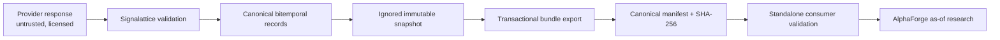

# Signal Foundry market-data contract

Signalattice publishes data; AlphaForge consumes it. The boundary is an immutable file
bundle so the repositories can evolve independently and neither imports the other's
internal code.

## Bundle layout

```text
<bundle-id>/
├── manifest.json
├── prices/
    ├── year=2024/part-00000.parquet
    └── year=2025/part-00000.parquet
├── universe/
│   └── part-00000.parquet
└── corporate_actions/
    └── part-00000.parquet
```

`bundle-id` is the SHA-256 digest of the semantic manifest: contract/schema version,
source snapshot and manifest hashes, producer Git SHA, exact file hashes/counts,
columns, coverage, universe, temporal rules, point-in-time limitations, licensing policy,
and redacted source provenance. Re-exporting identical canonical inputs with the same
producer/source identity returns the same bundle. A data or safety-metadata change
produces a new directory and never overwrites the old bundle.

## Schema 1.1.0

Version 1.1 retains the 1.0 price schema and adds optional, independently hashed
universe-membership and corporate-action record families. An empty family is meaningful:
the producer has no qualifying point-in-time evidence and the corresponding manifest
limitation must remain visible.

### Prices

| Field | Meaning |
|---|---|
| `date`, `ticker` | Canonical daily observation key |
| `open`, `high`, `low`, `close`, `adj_close`, `volume` | Validated market values |
| `effective_at` | Economic event time |
| `available_at` | Earliest time research may use the observation |
| `observed_at` | Provider retrieval time |
| `provider_updated_at` | Provider revision metadata, nullable when unavailable |
| `instrument_id` | Provider/canonical instrument identity |
| `currency` | Quote currency |
| `exchange_calendar` | Calendar identifier |
| `adjustment_state` | Explicit price-adjustment semantics |
| `source`, `source_table` | Provider lineage |

### Universe membership

| Field | Meaning |
|---|---|
| `membership_id` | Stable identity shared by revisions of one membership assertion |
| `universe_id`, `instrument_id`, `ticker` | Universe and canonical/provider instrument identity |
| `effective_at` | When the membership state economically takes effect |
| `available_at` | Earliest timestamp the assertion or revision was knowable |
| `observed_at` | Ingestion timestamp |
| `provider_updated_at` | Provider revision time, nullable when unavailable |
| `is_member`, `reason` | Membership state and auditable rationale |
| `source`, `source_table` | Provider lineage |

### Corporate actions

| Field | Meaning |
|---|---|
| `action_id` | Stable identity shared by revisions of one action |
| `instrument_id`, `ticker`, `action_type` | Instrument and validated action kind |
| `effective_at`, `available_at`, `observed_at`, `provider_updated_at` | Independent economic, knowledge, ingestion, and provider-revision times |
| `cash_amount`, `split_ratio` | Typed action values; required only for the matching action kind |
| `currency`, `old_ticker`, `new_ticker` | Currency and symbol-transition metadata |
| `adjustment_state` | Relationship between the action and published price adjustments |
| `source`, `source_table` | Provider lineage |

All temporal fields contain explicit timezone-aware values and are canonicalized to UTC.
Naive timestamps fail closed. Price observations are visible only when both `effective_at`
and `available_at` are no later than the decision timestamp. Versioned auxiliary records
use stable IDs; after temporal filtering, the reader returns the latest visible revision.
Future availability can therefore never rewrite an earlier view.

## Publication transaction

Publication validates required columns, finite values, positive prices, non-negative
volume, OHLC bounds, unique keys, temporal ordering, identity fields, and provider secret
attestation. It also validates record-family schemas, stable revision keys, supported
action types, action-specific values, and all three point-in-time limitation flags.
Partitions are written under `.publishing`, hashed, described by a canonical
manifest, then atomically renamed to the bundle identity. A failed publication removes
new staging and leaves no valid-looking partial bundle. Pre-existing stale staging is
preserved for operator inspection and blocks publication rather than being overwritten.

Licensed observations are never committed. CI uses provider-shaped synthetic fixtures.

## Consumer validation

Before reading any row, the standalone validator checks:

1. contract and supported schema version;
2. directory name equals bundle identity;
3. every path is relative and remains beneath the bundle root;
4. every partition exists and matches SHA-256 and row count;
5. exact column order and temporal/market invariants;
6. aggregate counts, coverage, universe, and semantic identity;
7. auxiliary revision/action invariants and absence of undeclared Parquet files.

Corruption, truncation, path traversal, duplicate keys, unsupported evolution, future
availability, or ambiguous provenance fails closed with
`SignalFoundryContractError`.

`load_signal_foundry_bundle_view(..., as_of=...)` validates the complete bundle before
returning prices, membership, or actions. `load_signal_foundry_bundle` is the
price-only compatibility API. Mutation tests prove that future observations,
constituents, action revisions, and source snapshots cannot alter an earlier as-of view.

## Reference fixture and benchmark

`tests/fixtures/signal_foundry_v1/current.json` points to a committed, deterministic,
redistribution-safe two-symbol 1.1 bundle spanning a year partition boundary and carrying
synthetic membership and dividend records. The previous 1.0 fixture remains committed as
a backward-compatibility target. Consumer repositories use these fixtures without
importing Signalattice or accessing the network. Rebuild 1.1 with:

```bash
python scripts/build_signal_foundry_fixture.py
```

The local benchmark exercises export, full validation, and an as-of read over 48,000
synthetic rows:

```bash
python scripts/benchmark_signal_foundry_contract.py
```

Version 1.1 raw samples and machine/runtime context are recorded in
[`docs/benchmarks/signal_foundry_contract_1_1_2026-07-25.json`](benchmarks/signal_foundry_contract_1_1_2026-07-25.json).
Across seven Apple M4 repetitions, median export throughput was approximately 60,135
rows/second; median complete validation was 0.396 seconds and median verified as-of
loading was 0.803 seconds. The earlier 1.0 evidence remains available for historical
comparison. These are laptop-scale references, not regression thresholds or
distributed-storage claims.

## Compatibility matrix

| Producer schema | Signalattice reader | Required consumer behavior |
|---|---|---|
| `1.0.0` | Supported; auxiliary families are empty | Preserve the price contract and explicit source limitations |
| `1.1.0` | Supported and current | Validate prices, universe, actions, hashes, counts, and revision semantics |
| Unknown `1.x` | Rejected until reviewed | Never assume additive compatibility without an explicit update |
| `2.x` or later | Rejected | Requires an ADR, migration plan, fixture, and coordinated AlphaForge release |

Breaking column, type, timestamp, stable-identity, adjustment, or as-of changes require a
new major version. No consumer may infer missing temporal, universe, revision, action, or
adjustment metadata.

## Lineage and trust boundaries



Provider payloads, manifests, Parquet metadata, paths, timestamps, and record identities
are untrusted until validation completes. The producer owns acquisition, canonicalization,
lineage, and publication. AlphaForge owns independent validation and research policy; it
must not import Signalattice or bypass the file boundary.

## Threat model and failure containment

| Threat | Control |
|---|---|
| Credential or licensed-data disclosure | Keychain-only secret retrieval; ignored data roots; synthetic committed fixtures |
| Look-ahead through revisions or constituents | Independent effective/available times and stable revision IDs |
| Path traversal or undeclared payload | Resolved-root checks and exact manifest-to-Parquet inventory |
| Corrupt, truncated, or partial publication | SHA-256/count verification and atomic rename |
| Stale staging or overwrite | Fail closed; immutable content-addressed destination |
| Schema confusion | Exact ordered columns and explicit supported-version set |
| False point-in-time claim | Required completeness flags are identity-bound and visible to consumers |

Rollback is a normal code revert plus selection of the previous immutable bundle. Never
rewrite or repair a published bundle in place.

## Producer and consumer runbook

1. Acquire and validate source data under the ignored local data root.
2. Inspect the redacted source manifest, completeness flags, license policy, and quality
   results.
3. Export with `signalattice export-signal-foundry-bundle`; never copy a staging directory.
4. Validate the exact emitted identity with
   `signalattice validate-signal-foundry-bundle <bundle>`.
5. Transfer the complete immutable directory through an authorized local/private channel.
6. In AlphaForge, validate before opening any partition and pin the bundle identity in the
   run manifest.
7. Apply one explicit timezone-aware decision timestamp to all record families.
8. Halt on any unsupported version, limitation-policy violation, missing hash, or
   reconciliation failure.

## Known limitations

The contract preserves the provenance supplied by the source; it cannot create historical
revisions, delisted constituents, corporate actions, or provider publication timestamps
that the subscription does not contain. Those limitations are part of the manifest and
must remain visible in AlphaForge reports and readiness decisions.
