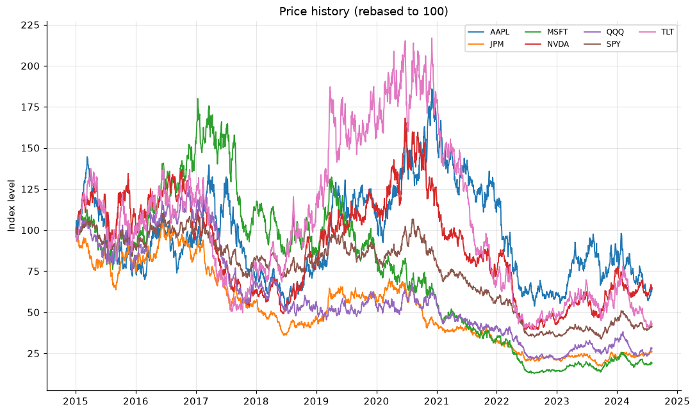
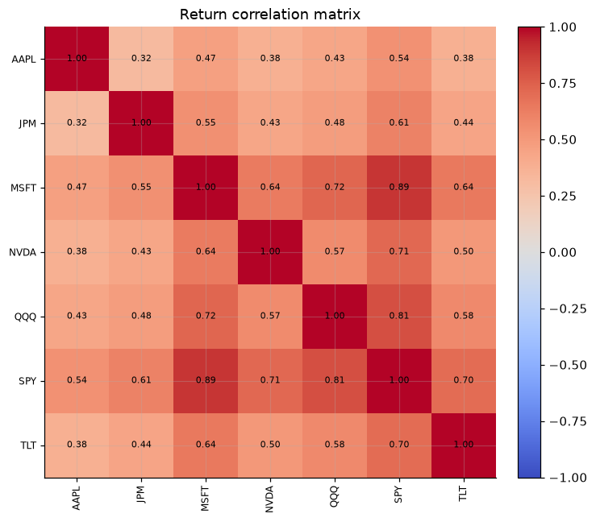
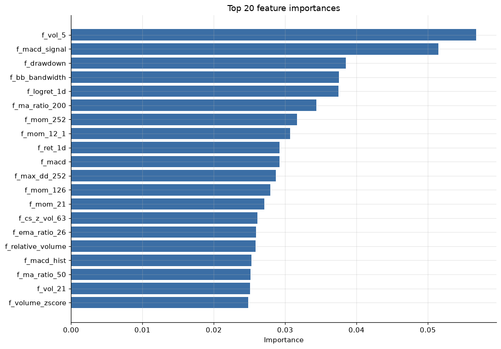
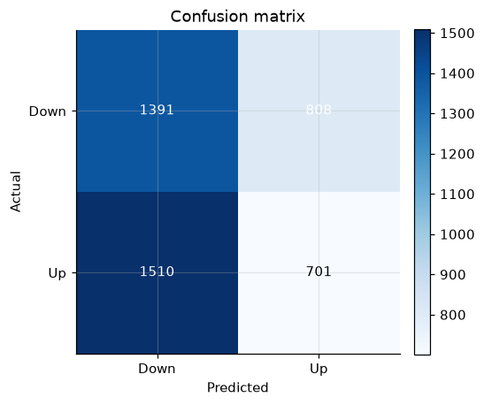
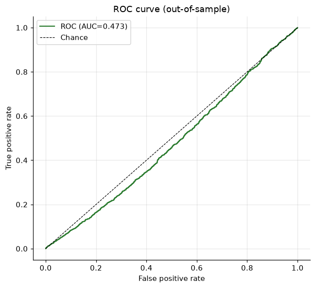
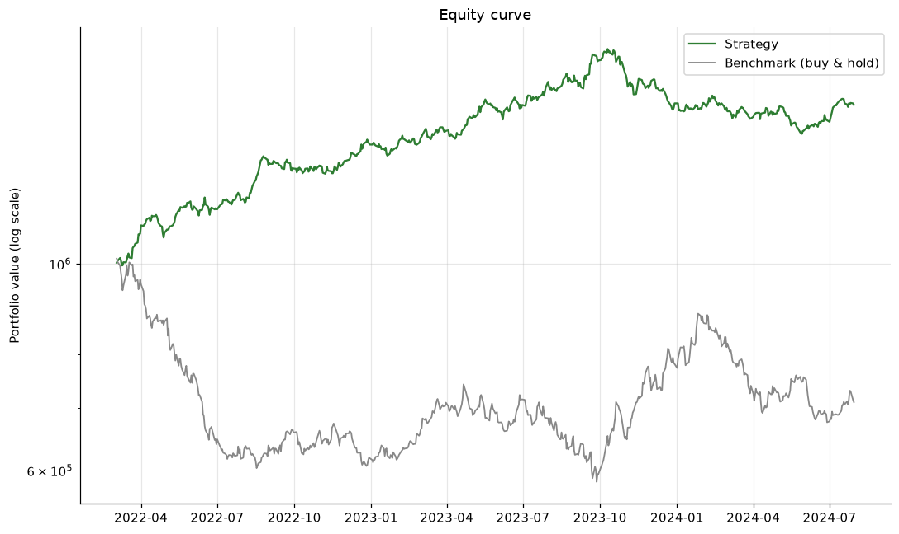
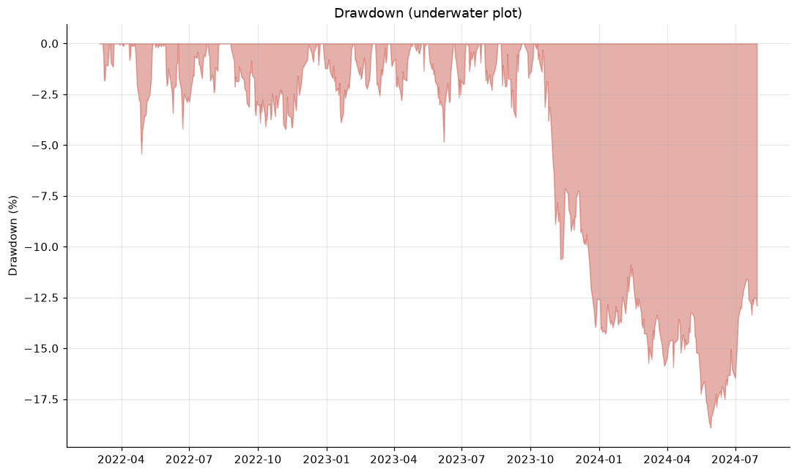
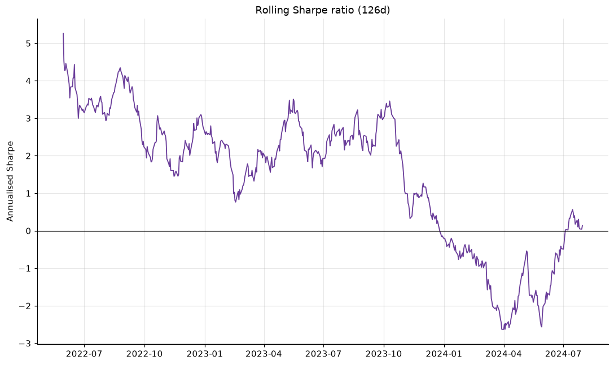
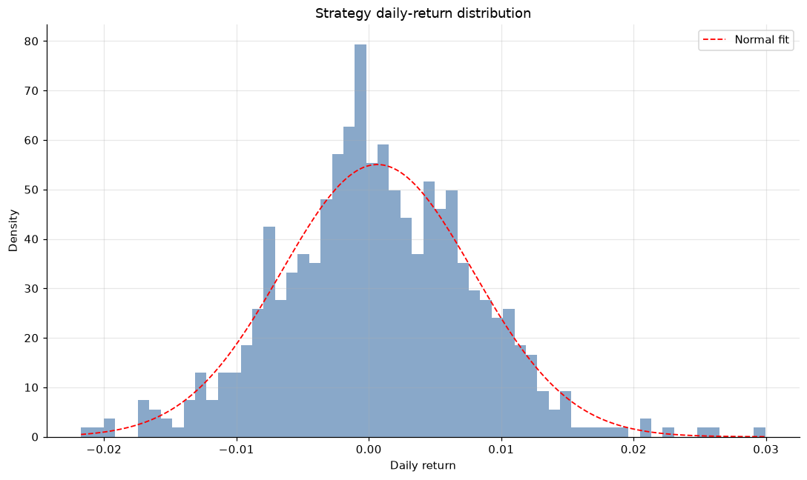
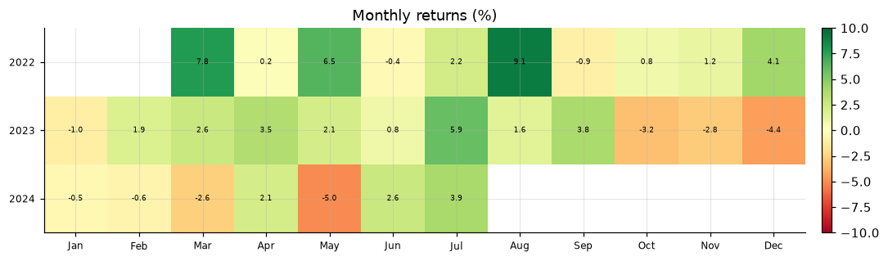

# Quant Research Platform — Example Run

> **Disclaimer.** This report is generated by an educational / portfolio research platform. It is **not financial advice** and **not intended for live trading**. Simulated/backtested performance has many well-known biases and does not guarantee future results.

## 1. Run metadata

| Metric | Value |
|---|---|
| Generated | 2026-06-28 02:01 UTC |
| Config / experiment | example |
| Random seed | 42.000 |
| Data source | synthetic |
| Dataset hash | e9a547b9dffd |
| Git commit | 0e24b9f |
| Model | random_forest (classification) |
| Strategy | long_short / model |

## 2. Data

| Metric | Value |
|---|---|
| Tickers | AAPL, JPM, MSFT, NVDA, QQQ, SPY, TLT |
| Benchmark | SPY |
| Date range | 2015-01-01 → 2024-07-31 |
| Observations | 17500.000 |
| Price field | adj_close |

## 3. Features

- **41** features engineered per (date, ticker).

- Families: returns, volatility/realised-vol, moving-average & EMA trend, RSI/MACD oscillators, Bollinger bands, momentum & 12-1 momentum, mean-reversion z-scores, volume features, rolling beta, drawdown features, and cross-sectional ranks/z-scores.

Full feature list

- `f_ret_1d`
- `f_logret_1d`
- `f_ret_5d`
- `f_vol_5`
- `f_vol_21`
- `f_vol_63`
- `f_realized_vol_21`
- `f_sharpe_63`
- `f_ma_ratio_10`
- `f_ma_ratio_20`
- `f_ma_ratio_50`
- `f_ma_ratio_200`
- `f_ema_ratio_12`
- `f_ema_ratio_26`
- `f_rsi_14`
- `f_macd`
- `f_macd_signal`
- `f_macd_hist`
- `f_bb_pctb`
- `f_bb_bandwidth`
- `f_mom_21`
- `f_mom_63`
- `f_mom_126`
- `f_mom_252`
- `f_mom_12_1`
- `f_reversal_5`
- `f_zscore_21`
- `f_log_dollar_volume`
- `f_volume_zscore`
- `f_relative_volume`
- `f_beta_63`
- `f_drawdown`
- `f_max_dd_252`
- `f_cs_rank_mom_12_1`
- `f_cs_z_mom_12_1`
- `f_cs_rank_reversal_5`
- `f_cs_z_reversal_5`
- `f_cs_rank_vol_63`
- `f_cs_z_vol_63`
- `f_cs_rank_rsi_14`
- `f_cs_z_rsi_14`

## 4. Model performance (out-of-sample, walk-forward)

| Metric | Value |
|---|---|
| accuracy | 0.474 |
| precision | 0.465 |
| recall | 0.317 |
| f1 | 0.377 |
| roc_auc | 0.473 |

**Per-fold metrics**

|   fold |   accuracy |   precision |   recall |    f1 |   roc_auc |
|--------|------------|-------------|----------|-------|-----------|
|      0 |      0.486 |       0.447 |    0.658 | 0.533 |     0.519 |
|      1 |      0.468 |       0.700 |    0.029 | 0.056 |     0.534 |
|      2 |      0.501 |       0.506 |    0.186 | 0.272 |     0.507 |
|      3 |      0.451 |       0.541 |    0.161 | 0.248 |     0.506 |
|      4 |      0.465 |       0.444 |    0.661 | 0.531 |     0.461 |

## 5. Backtest performance

| Metric | Strategy | Benchmark |
|---|---|---|
| cagr | 17.06% | -12.79% |
| ann_volatility | 11.51% | 21.05% |
| sharpe | 1.427 | -0.544 |
| sortino | 1.528 | -0.523 |
| calmar | 0.902 | -0.301 |
| max_drawdown | -18.91% | -42.43% |
| var_95 | 1.09% | 2.26% |
| cvar_95 | 1.45% | 2.94% |
| hit_rate | 51.67% | 50.40% |
| beta | -0.093 | None |

**Trading activity**

| Metric | Value |
|---|---|
| n_days | 629.000 |
| avg_positions | 4.000 |
| avg_long_positions | 2.000 |
| avg_short_positions | 2.000 |
| avg_gross_exposure | 100.00% |
| avg_net_exposure | 0.00% |
| avg_daily_turnover | 0.918 |
| best_day | 3.00% |
| worst_day | -2.17% |
| pct_positive_days | 51.67% |

**Monthly returns**

|   year |    Jan |    Feb |    Mar |   Apr |    May |    Jun |   Jul |   Aug |    Sep |    Oct |    Nov |    Dec |   YEAR |
|--------|--------|--------|--------|-------|--------|--------|-------|-------|--------|--------|--------|--------|--------|
|   2022 |   nan% |   nan% |  7.78% | 0.19% |  6.47% | -0.36% | 2.19% | 9.11% | -0.89% |  0.75% |  1.16% |  4.11% | 34.33% |
|   2023 | -1.00% |  1.86% |  2.59% | 3.55% |  2.13% |  0.80% | 5.88% | 1.56% |  3.79% | -3.21% | -2.79% | -4.40% | 10.71% |
|   2024 | -0.46% | -0.63% | -2.60% | 2.13% | -5.02% |  2.61% | 3.90% |  nan% |   nan% |   nan% |   nan% |   nan% | -0.37% |

## 6. Risk analytics

| Metric | Value |
|---|---|
| ann_volatility | 11.51% |
| sharpe | 1.427 |
| sortino | 1.528 |
| max_drawdown | -18.91% |
| var_95 | 1.09% |
| cvar_95 | 1.45% |
| beta | -0.093 |
| avg_gross_exposure | 100.00% |
| avg_net_exposure | 0.00% |
| annual_turnover | 23136.72% |

**Stress / scenario analysis**

| scenario      | type         |   shock |   estimated_pnl |
|---------------|--------------|---------|-----------------|
| equity_-10pct | equity_shock | -10.00% |           0.93% |
| equity_-20pct | equity_shock | -20.00% |           1.86% |
| vol_spike_2x  | vol_shock    | 200.00% |          -2.19% |

## 7. Limitations

- Daily close-to-close data only; no intraday, order-book, or borrow data.
- Transaction costs/slippage are modelled as a flat per-turnover bps charge; real costs are size-, liquidity- and regime-dependent.
- Survivorship bias: the universe is fixed and current; delisted names are absent.
- Free data vendors may have adjustment/quality quirks vs. institutional feeds.
- Single-config run; no hyper-parameter search or multiple-testing correction, so reported OOS edges should be treated cautiously.

## 8. Future work

- Intraday & alternative data; survivorship-bias-free universes.
- Portfolio optimisation (mean-variance / risk-parity) and factor-risk models.
- Hyper-parameter search with nested, purged cross-validation.
- Event-driven backtester with realistic fills and capacity modelling.
- Distributed backtesting and cloud orchestration.
