# Signalattice — Synthetic Forecast Decision-Readiness

> **Research-use only.** This artifact is not financial advice or an authorization to trade. Backtests and synthetic experiments are evidence about software and validation behavior, not proof of live-market alpha.

## 1. Executive decision

| Metric | Value |
|---|---|
| Readiness verdict | NOT_READY |
| Criteria passed | 6/7 |
| Evidence class | declared synthetic engineering experiment |
| Break-even one-way cost (bps) | 6.842 |
| Assumed one-way cost (bps) | 1.500 |

**Decision:** do not promote this configuration to capital deployment. Failed gates identify the experiments required before a shadow-trading review; they are not averaged away into a composite score.

## 2. Run provenance

| Metric | Value |
|---|---|
| Generated | 2026-07-14 18:54 UTC |
| Config / experiment | synthetic_calibrated_ensemble |
| Random seed | 42 |
| Data source | synthetic |
| Synthetic data | yes |
| Dataset hash | a17a783e9126 |
| Git commit | 7597b75 |
| Requested model | ensemble (classification) |
| Effective model | chronological-sigmoid-ensemble[logistic=0.337216,random_forest=0.336508,gradient_boosting=0.326277] |
| Forecast horizon | 1 bar(s) |
| CV embargo | 5 bar(s) |
| Execution lag | 2 bar(s) |
| Strategy | long_short / model |

## 3. Data and feature contract

| Metric | Value |
|---|---|
| Tickers | AAPL, GLD, IWM, JPM, MSFT, NVDA, QQQ, SPY, TLT, XOM |
| Benchmark | SPY |
| Date range | 2015-01-01 → 2023-06-07 |
| Observations | 22,000 |
| Price field | adj_close |

- **41** features engineered per (date, ticker).

- Families: returns, volatility/realised-vol, moving-average & EMA trend, RSI/MACD oscillators, Bollinger bands, momentum & 12-1 momentum, mean-reversion z-scores, volume features, rolling beta, drawdown features, and cross-sectional ranks/z-scores.

Full feature list

- `f_ret_1d`
- `f_logret_1d`
- `f_ret_5d`
- `f_vol_5`
- `f_vol_21`
- `f_vol_63`
- `f_realized_vol_21`
- `f_sharpe_63`
- `f_ma_ratio_10`
- `f_ma_ratio_20`
- `f_ma_ratio_50`
- `f_ma_ratio_200`
- `f_ema_ratio_12`
- `f_ema_ratio_26`
- `f_rsi_14`
- `f_macd`
- `f_macd_signal`
- `f_macd_hist`
- `f_bb_pctb`
- `f_bb_bandwidth`
- `f_mom_21`
- `f_mom_63`
- `f_mom_126`
- `f_mom_252`
- `f_mom_12_1`
- `f_reversal_5`
- `f_zscore_21`
- `f_log_dollar_volume`
- `f_volume_zscore`
- `f_relative_volume`
- `f_beta_63`
- `f_drawdown`
- `f_max_dd_252`
- `f_cs_rank_mom_12_1`
- `f_cs_z_mom_12_1`
- `f_cs_rank_reversal_5`
- `f_cs_z_reversal_5`
- `f_cs_rank_vol_63`
- `f_cs_z_vol_63`
- `f_cs_rank_rsi_14`
- `f_cs_z_rsi_14`

## 4. Forecast quality (strictly out of sample)

| Metric | Value |
|---|---|
| accuracy | 0.552 |
| balanced_accuracy | 0.545 |
| precision | 0.531 |
| recall | 0.427 |
| f1 | 0.473 |
| matthews_corrcoef | 0.092 |
| roc_auc | 0.569 |
| average_precision | 0.529 |
| log_loss | 0.685 |
| brier_score | 0.246 |
| brier_skill_score | 0.013 |
| expected_calibration_error | 1.83% |

**Per-fold metrics**

|   fold |   accuracy |   balanced_accuracy |   precision |   recall |    f1 |   matthews_corrcoef |   roc_auc |   average_precision |   log_loss |   brier_score |   brier_skill_score |   expected_calibration_error |
|--------|------------|---------------------|-------------|----------|-------|---------------------|-----------|---------------------|------------|---------------|---------------------|------------------------------|
|      0 |      0.528 |               0.557 |       0.467 |    0.755 | 0.577 |               0.121 |     0.602 |               0.522 |      0.691 |         0.249 |              -0.016 |                        0.105 |
|      1 |      0.571 |               0.514 |       0.543 |    0.080 | 0.140 |               0.058 |     0.587 |               0.507 |      0.676 |         0.242 |               0.016 |                        0.040 |
|      2 |      0.539 |               0.536 |       0.552 |    0.341 | 0.422 |               0.078 |     0.568 |               0.545 |      0.689 |         0.248 |               0.008 |                        0.042 |
|      3 |      0.568 |               0.571 |       0.609 |    0.528 | 0.565 |               0.142 |     0.596 |               0.611 |      0.684 |         0.245 |               0.015 |                        0.037 |

**Date-block bootstrap interval**

| Metric | Value |
|---|---|
| estimate | 0.552 |
| lower | 0.532 |
| upper | 0.571 |
| standard_error | 0.010 |
| confidence_level | 0.950 |
| n_bootstrap | 300 |
| block_size | 5 |
| n_dates | 504 |

**Brier decomposition**

| Metric | Value |
|---|---|
| brier_score | 0.246 |
| reliability | 0.001 |
| resolution | 0.004 |
| uncertainty | 0.249 |
| decomposed_brier_score | 0.246 |
| decomposition_residual | -0.000 |

**Reliability table**

|     bin |   bin_lower |   bin_upper |     count |   fraction |   mean_probability |   observed_rate |   absolute_gap |   weighted_absolute_gap |
|---------|-------------|-------------|-----------|------------|--------------------|-----------------|----------------|-------------------------|
|  1.0000 |      0.0000 |      0.1000 |    0.0000 |     0.0000 |           nan      |        nan      |       nan      |                  0.0000 |
|  2.0000 |      0.1000 |      0.2000 |    0.0000 |     0.0000 |           nan      |        nan      |       nan      |                  0.0000 |
|  3.0000 |      0.2000 |      0.3000 |  141.0000 |     0.0280 |             0.2760 |          0.3050 |         0.0290 |                  0.0008 |
|  4.0000 |      0.3000 |      0.4000 |  956.0000 |     0.1897 |             0.3598 |          0.4090 |         0.0492 |                  0.0093 |
|  5.0000 |      0.4000 |      0.5000 | 2028.0000 |     0.4024 |             0.4570 |          0.4571 |         0.0001 |                  0.0000 |
|  6.0000 |      0.5000 |      0.6000 | 1636.0000 |     0.3246 |             0.5389 |          0.5226 |         0.0163 |                  0.0053 |
|  7.0000 |      0.6000 |      0.7000 |  279.0000 |     0.0554 |             0.6290 |          0.5771 |         0.0519 |                  0.0029 |
|  8.0000 |      0.7000 |      0.8000 |    0.0000 |     0.0000 |           nan      |        nan      |       nan      |                  0.0000 |
|  9.0000 |      0.8000 |      0.9000 |    0.0000 |     0.0000 |           nan      |        nan      |       nan      |                  0.0000 |
| 10.0000 |      0.9000 |      1.0000 |    0.0000 |     0.0000 |           nan      |        nan      |       nan      |                  0.0000 |

**Candidate model comparison**

| candidate         |   accuracy |   balanced_accuracy |   precision |   recall |     f1 |   matthews_corrcoef |   roc_auc |   average_precision |   log_loss |   brier_score |   brier_skill_score |   expected_calibration_error |
|-------------------|------------|---------------------|-------------|----------|--------|---------------------|-----------|---------------------|------------|---------------|---------------------|------------------------------|
| logistic          |     0.5343 |              0.5268 |      0.5081 |   0.3946 | 0.4442 |              0.0556 |    0.5417 |              0.5031 |     0.6987 |        0.2523 |             -0.0125 |                       0.0540 |
| random_forest     |     0.5718 |              0.5666 |      0.5538 |   0.4745 | 0.5111 |              0.1355 |    0.5903 |              0.5498 |     0.6794 |        0.2432 |              0.0241 |                       0.0104 |
| gradient_boosting |     0.5435 |              0.5395 |      0.5176 |   0.4699 | 0.4926 |              0.0797 |    0.5609 |              0.5181 |     0.6889 |        0.2478 |              0.0057 |                       0.0274 |

**Final ensemble weights**

| Metric | Value |
|---|---|
| logistic | 0.337 |
| random_forest | 0.337 |
| gradient_boosting | 0.326 |

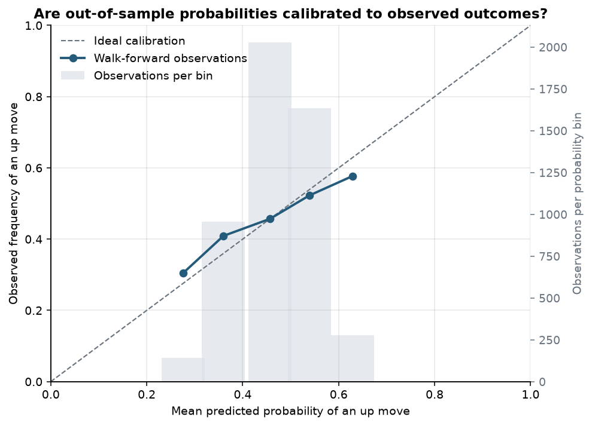

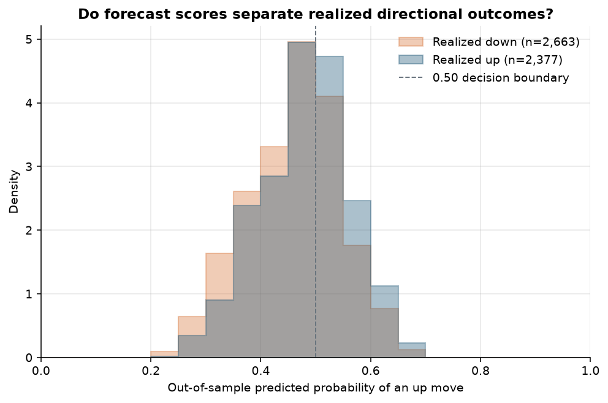

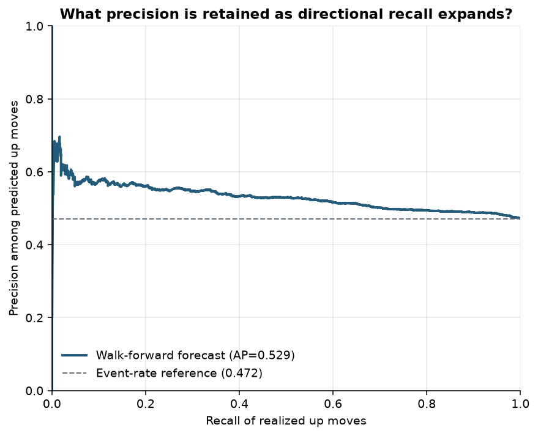

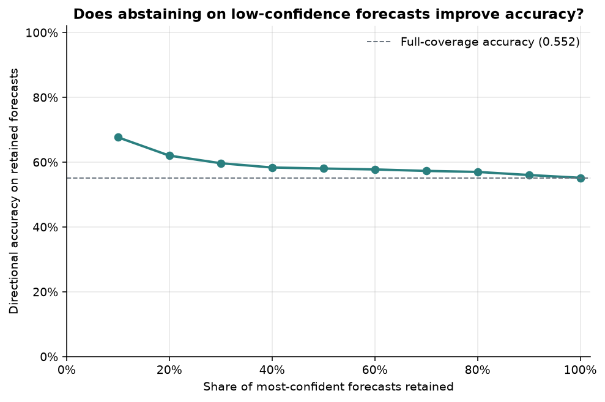

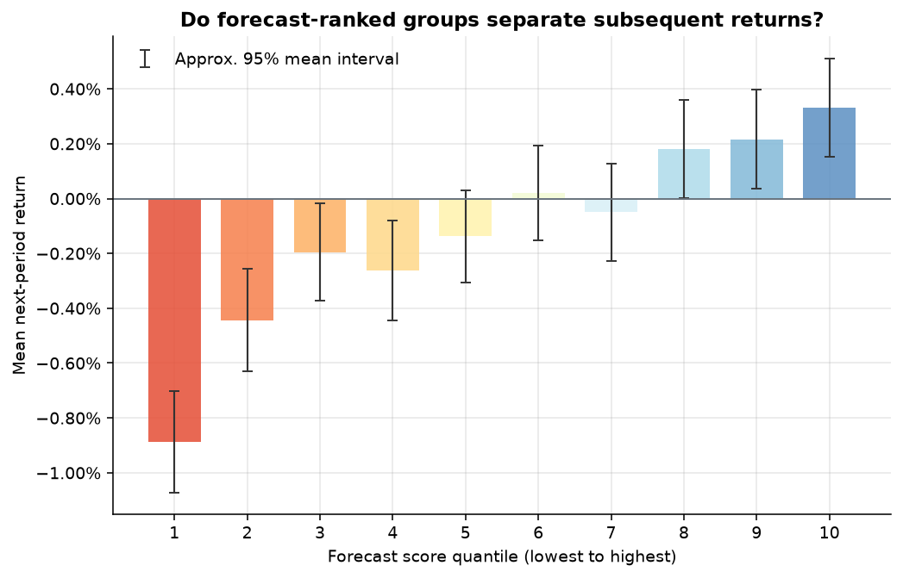

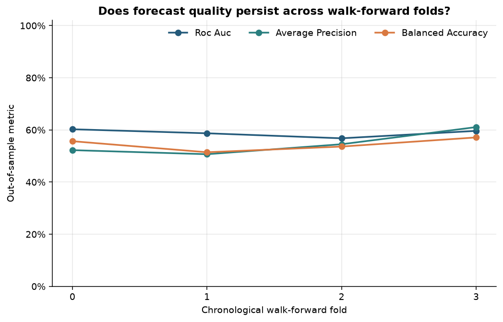

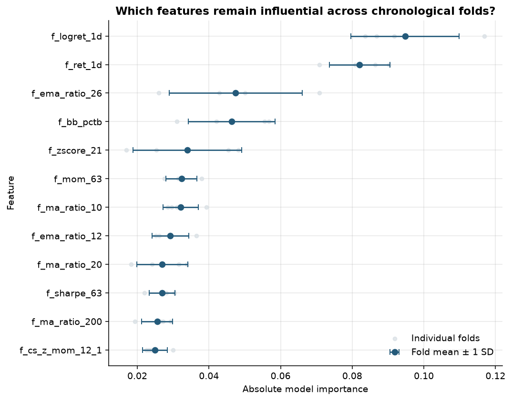

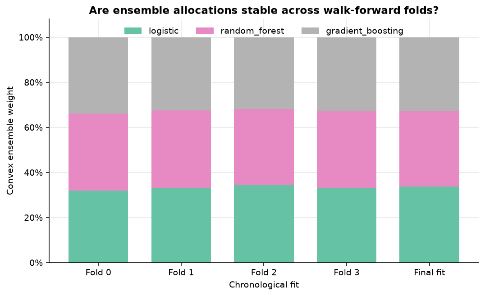

## 5. Economic translation

| Metric | Strategy | Benchmark |
|---|---|---|
| cagr | 13.92% | -29.74% |
| ann_volatility | 10.60% | 19.18% |
| sharpe | 1.283 | -1.743 |
| sortino | 1.408 | -1.687 |
| calmar | 1.579 | -0.502 |
| max_drawdown | -8.82% | -59.29% |
| var_95 | 1.00% | 2.00% |
| cvar_95 | 1.34% | 2.59% |
| hit_rate | 49.90% | 45.33% |
| beta | -0.061 | None |

**Trading activity**

| Metric | Value |
|---|---|
| n_days | 503 |
| avg_positions | 6.000 |
| avg_long_positions | 3.000 |
| avg_short_positions | 3.000 |
| avg_gross_exposure | 100.00% |
| avg_net_exposure | 0.00% |
| avg_daily_turnover | 1.010 |
| best_day | 2.16% |
| worst_day | -1.80% |
| pct_positive_days | 49.90% |

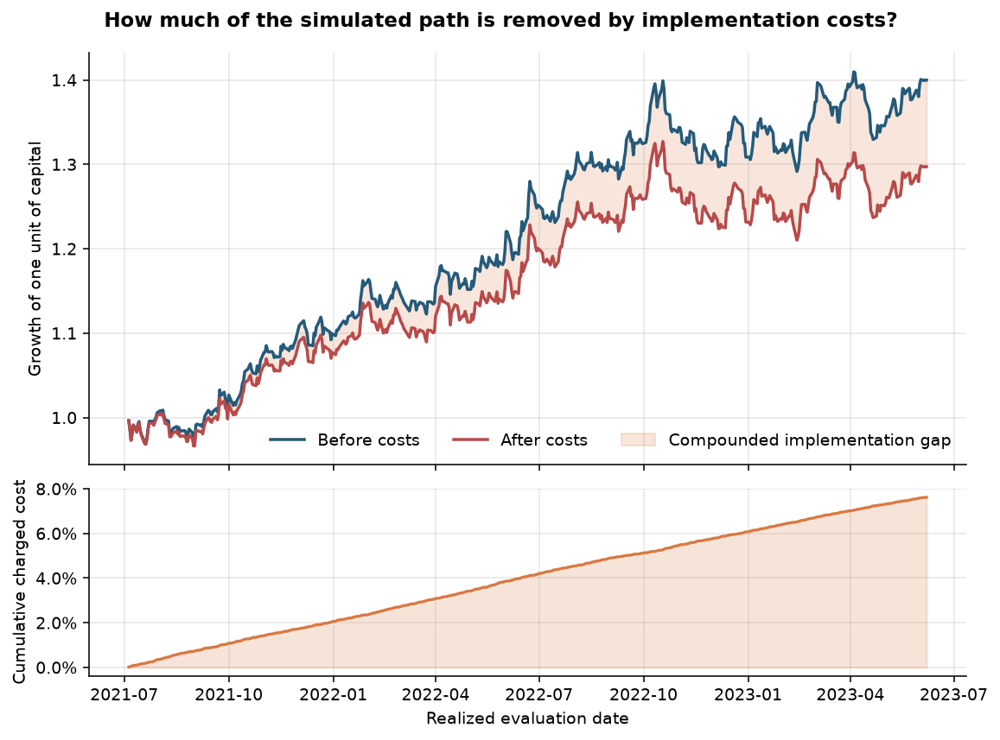

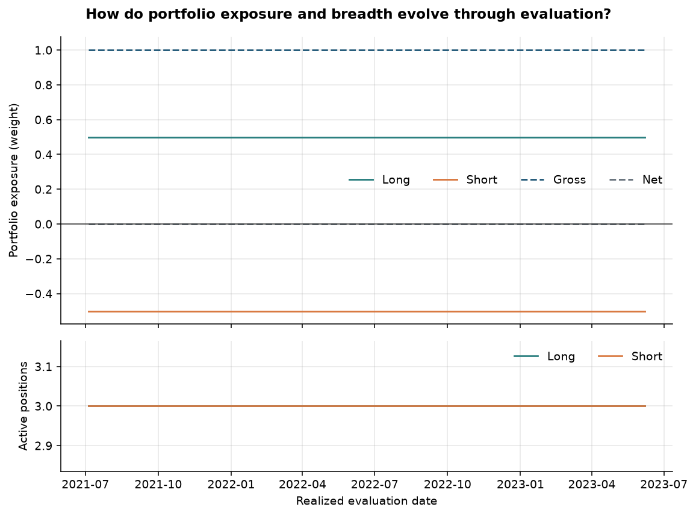

**Monthly returns**

|   year |   Jan |    Feb |    Mar |    Apr |   May |   Jun |   Jul |    Aug |   Sep |   Oct |    Nov |    Dec |   YEAR |
|--------|-------|--------|--------|--------|-------|-------|-------|--------|-------|-------|--------|--------|--------|
|   2021 |  nan% |   nan% |   nan% |   nan% |  nan% |  nan% | 0.23% | -3.60% | 3.32% | 5.49% |  2.54% | -0.24% |  7.72% |
|   2022 | 5.26% | -1.26% | -1.61% |  1.04% | 2.41% | 5.31% | 2.08% |  1.46% | 1.20% | 0.69% | -2.73% | -0.07% | 14.33% |
|   2023 | 0.25% |  3.11% |  1.92% | -3.54% | 2.23% | 1.38% |  nan% |   nan% |  nan% |  nan% |   nan% |   nan% |  5.33% |

## 6. Cost, delay, capacity, and latency

**Transaction-cost frontier**

|   total_one_way_cost_bps |   periods |   net_total_return |   gross_total_return |   terminal_equity |    cagr |   sharpe |   max_drawdown |   annual_turnover |   total_cost_drag |
|--------------------------|-----------|--------------------|----------------------|-------------------|---------|----------|----------------|-------------------|-------------------|
|                   0.0000 |  503.0000 |             0.3998 |               0.3998 |      1399751.9481 |  0.1835 |   1.6427 |        -0.0768 |          254.5050 |            0.0000 |
|                   1.5000 |  503.0000 |             0.2971 |               0.3998 |      1297123.4282 |  0.1392 |   1.2832 |        -0.0882 |          254.5050 |            0.0762 |
|                   3.0000 |  503.0000 |             0.2020 |               0.3998 |      1202003.8896 |  0.0966 |   0.9233 |        -0.0995 |          254.5050 |            0.1524 |
|                   5.0000 |  503.0000 |             0.0859 |               0.3998 |      1085916.6729 |  0.0422 |   0.4429 |        -0.1143 |          254.5050 |            0.2540 |
|                  10.0000 |  503.0000 |            -0.1577 |               0.3998 |       842323.7610 | -0.0824 |  -0.7596 |        -0.1789 |          254.5050 |            0.5080 |
|                  25.0000 |  503.0000 |            -0.6072 |               0.3998 |       392779.3991 | -0.3739 |  -4.3560 |        -0.6098 |          254.5050 |            1.2700 |

**Incremental execution-delay decay**

|   additional_delay_bars |   configured_execution_lag_bars |   total_lag_bars |   periods |   net_total_return |   gross_total_return |   terminal_equity |    cagr |   sharpe |   max_drawdown |   annual_turnover |   total_cost_drag |
|-------------------------|---------------------------------|------------------|-----------|--------------------|----------------------|-------------------|---------|----------|----------------|-------------------|-------------------|
|                  0.0000 |                          2.0000 |           2.0000 |  498.0000 |             0.3097 |               0.4121 |      1309681.6868 |  0.1463 |   1.3486 |        -0.0882 |          254.1928 |            0.0754 |
|                  1.0000 |                          2.0000 |           3.0000 |  498.0000 |            -0.0332 |               0.0425 |       966767.3579 | -0.0170 |  -0.1119 |        -0.1615 |          254.5301 |            0.0754 |
|                  2.0000 |                          2.0000 |           4.0000 |  498.0000 |            -0.1287 |              -0.0602 |       871327.9984 | -0.0673 |  -0.6200 |        -0.2170 |          255.0361 |            0.0756 |
|                  3.0000 |                          2.0000 |           5.0000 |  498.0000 |            -0.1309 |              -0.0626 |       869071.4637 | -0.0685 |  -0.6127 |        -0.2076 |          255.2048 |            0.0756 |
|                  5.0000 |                          2.0000 |           7.0000 |  498.0000 |            -0.1170 |              -0.0475 |       882991.0396 | -0.0610 |  -0.5392 |        -0.1457 |          255.5422 |            0.0757 |

**Dollar-volume capacity proxy**

|           aum | proxy_label                                | price_column   |   liquidity_window_bars |   participation_limit |   trade_count |   liquidity_observation_count |   liquidity_coverage |   total_weight_turnover |   total_traded_notional |   median_participation_rate |   p95_participation_rate |   max_participation_rate |   share_trades_above_limit |   capacity_at_participation_limit |
|---------------|--------------------------------------------|----------------|-------------------------|-----------------------|---------------|-------------------------------|----------------------|-------------------------|-------------------------|-----------------------------|--------------------------|--------------------------|----------------------------|-----------------------------------|
|  1000000.0000 | trailing_20_bar_median_dollar_volume_proxy | close          |                      20 |                0.0100 |          2602 |                          2602 |               1.0000 |                508.0000 |          508000000.0000 |                      0.0030 |                   0.0330 |                   0.1030 |                     0.2267 |                        97065.7874 |
|  5000000.0000 | trailing_20_bar_median_dollar_volume_proxy | close          |                      20 |                0.0100 |          2602 |                          2602 |               1.0000 |                508.0000 |         2540000000.0000 |                      0.0151 |                   0.1648 |                   0.5151 |                     0.6203 |                        97065.7874 |
| 10000000.0000 | trailing_20_bar_median_dollar_volume_proxy | close          |                      20 |                0.0100 |          2602 |                          2602 |               1.0000 |                508.0000 |         5080000000.0000 |                      0.0301 |                   0.3296 |                   1.0302 |                     0.7171 |                        97065.7874 |
| 25000000.0000 | trailing_20_bar_median_dollar_volume_proxy | close          |                      20 |                0.0100 |          2602 |                          2602 |               1.0000 |                508.0000 |        12700000000.0000 |                      0.0754 |                   0.8239 |                   2.5756 |                     0.8966 |                        97065.7874 |

**Warm synchronous inference benchmark**

|   batch_size |   warmup_runs |   measured_runs | timer           |   mean_latency_ms |   p50_latency_ms |   p95_latency_ms |   p99_latency_ms |   throughput_rows_per_second |
|--------------|---------------|-----------------|-----------------|-------------------|------------------|------------------|------------------|------------------------------|
|            1 |             3 |              15 | perf_counter_ns |           16.0266 |          16.2616 |          16.4732 |          16.5553 |                      62.3962 |
|           64 |             3 |              15 | perf_counter_ns |           14.8887 |          15.2998 |          16.3651 |          16.4167 |                    4298.5612 |
|          512 |             3 |              15 | perf_counter_ns |           15.2255 |          15.2218 |          19.1896 |          23.7534 |                   33627.7463 |

**Readiness criteria**

| criterion                 | metric                               | status   | passed   |   observed |   threshold | operator   |
|---------------------------|--------------------------------------|----------|----------|------------|-------------|------------|
| predictive_calibration    | expected_calibration_error           | PASS     | True     |     0.0183 |      0.0500 | <=         |
| economic_robustness       | break_even_one_way_cost_bps          | PASS     | True     |     6.8423 |      3.0000 | >=         |
| stability                 | positive_walk_forward_fold_fraction  | PASS     | True     |     1.0000 |      0.6000 | >=         |
| operational_latency       | warm_p95_latency_ms                  | PASS     | True     |    19.1896 |   1000.0000 | <=         |
| predictive_discrimination | walk_forward_roc_auc                 | PASS     | True     |     0.5691 |      0.5200 | >=         |
| net_economic_quality      | net_sharpe                           | PASS     | True     |     1.2832 |      0.5000 | >=         |
| liquidity_capacity        | p95_dollar_volume_participation_rate | FAIL     | False    |     0.0330 |      0.0100 | <=         |

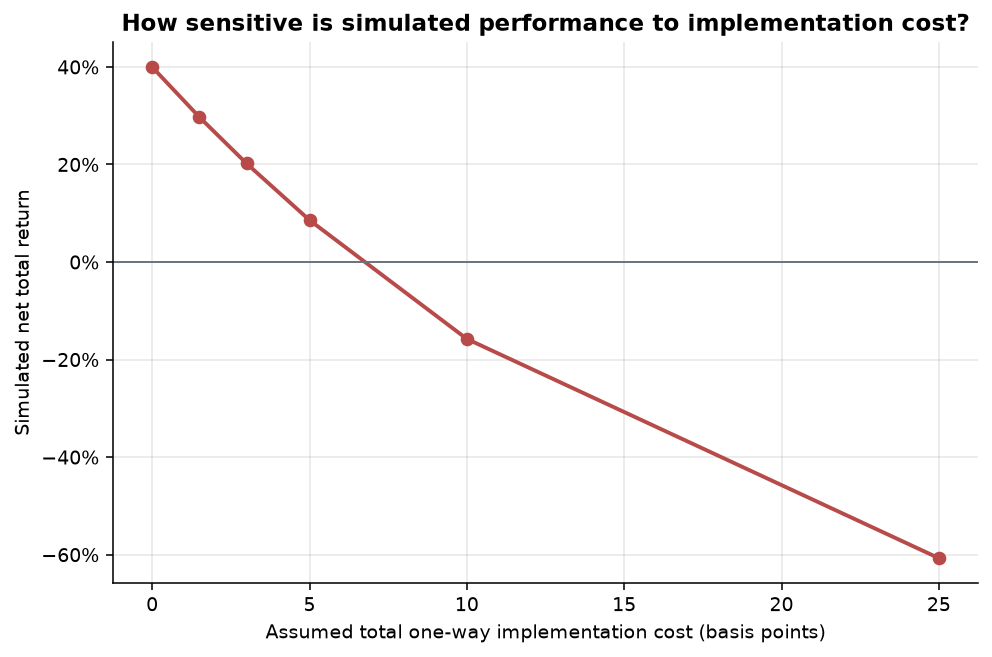

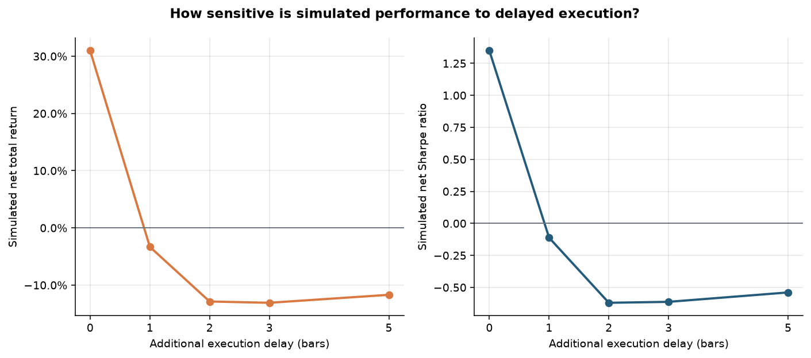

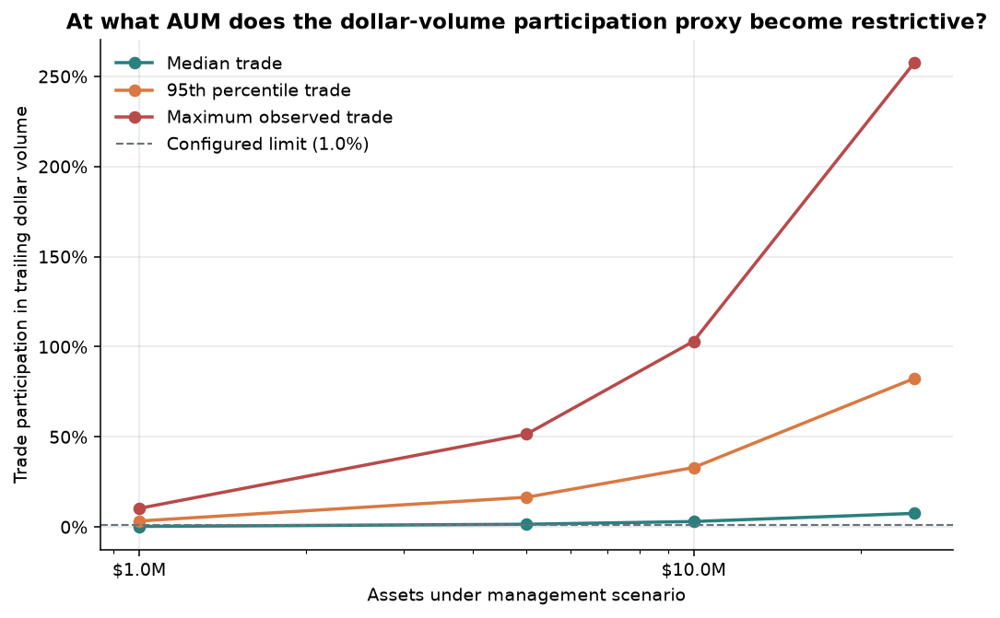

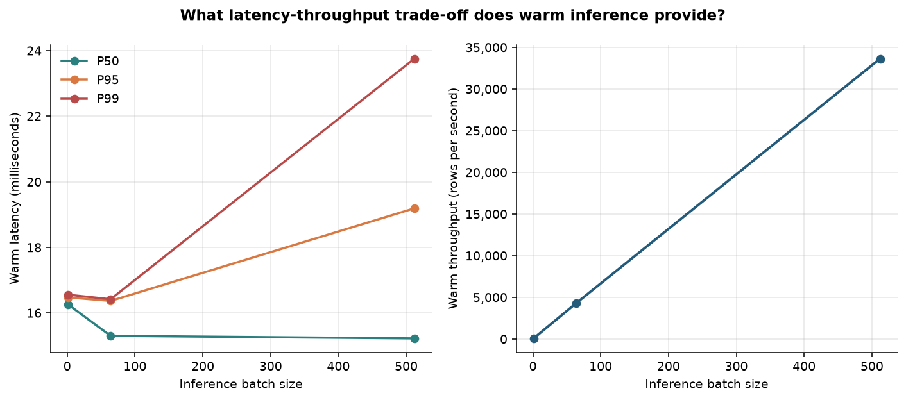

## 7. Risk analytics

| Metric | Value |
|---|---|
| ann_volatility | 10.60% |
| sharpe | 1.283 |
| sortino | 1.408 |
| max_drawdown | -8.82% |
| var_95 | 1.00% |
| cvar_95 | 1.34% |
| beta | -0.061 |
| avg_gross_exposure | 100.00% |
| avg_net_exposure | 0.00% |
| annual_turnover | 25450.50% |

**Stress / scenario analysis**

| scenario      | type         |   shock |   estimated_pnl |
|---------------|--------------|---------|-----------------|
| equity_-10pct | equity_shock | -10.00% |           0.61% |
| equity_-20pct | equity_shock | -20.00% |           1.23% |
| vol_spike_2x  | vol_shock    | 200.00% |          -2.00% |

## 8. What this run does not establish

- Daily bars cannot establish intraday fill quality, queue position, spread, borrow availability, market impact, or exchange-level latency.
- The capacity table is a trailing dollar-volume participation proxy, not an order-book execution simulator.
- A current fixed universe can contain selection and survivorship bias; free vendor data can differ from point-in-time institutional data.
- One walk-forward experiment does not control data mining across all ideas a researcher might have tried. Independent replication and shadow evaluation remain mandatory.

## 9. Reproduction and promotion contract

The committed configuration, dataset fingerprint, seed, Git commit, fold definitions, calibrated OOS predictions, and gate thresholds form the audit contract. Promotion requires every readiness criterion to pass on evidence appropriate to the next stage; changing a threshold creates a new experiment, not a reinterpretation of this result.
